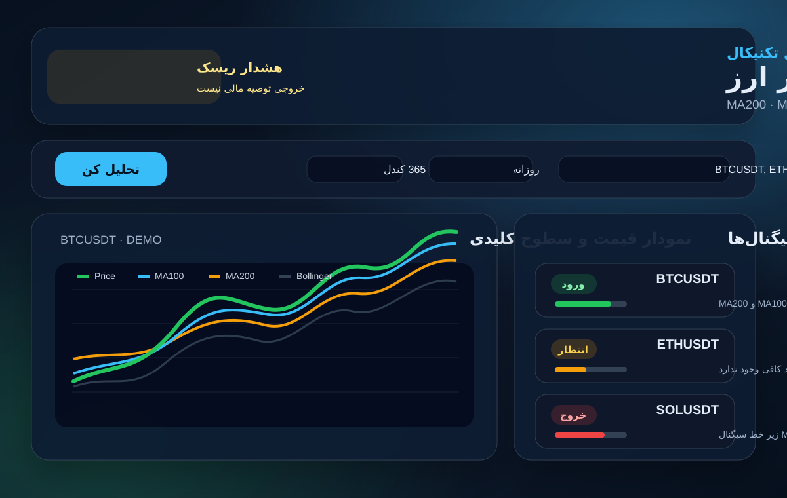

# اپلیکیشن سیگنال ورود و خروج رمز ارز

یک داشبورد ساده فارسی برای بررسی چند رمز ارز و ساخت پیشنهاد «ورود»، «خروج» یا «انتظار» بر اساس این اندیکاتورها:



- Moving Average 100
- Moving Average 200
- MACD با دوره سریع 14، دوره کند 28 و سیگنال 9
- RSI 14
- Bollinger Bands 20/2

## اجرا

```bash
npm start
```

سپس مرورگر را روی آدرس زیر باز کنید:

```text
http://localhost:4173
```

## تست

```bash
npm test
```

## نکته مهم

داده‌ها از Binance Klines API خوانده می‌شوند. اگر دریافت داده زنده در مرورگر ممکن نشود، اپلیکیشن یک دیتای نمایشی داخلی نشان می‌دهد تا رابط کاربری و محاسبات قابل بررسی باشند. خروجی برنامه توصیه مالی نیست و باید همراه با مدیریت ریسک و تحلیل شخصی استفاده شود.
